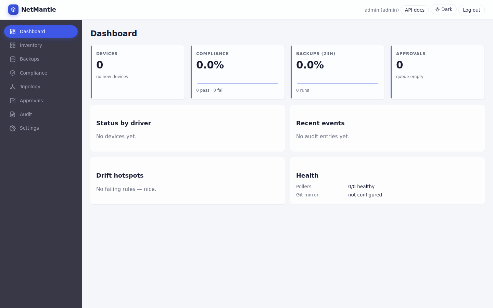

# NetMantle

[](https://github.com/i4Edu/netmantle/actions/workflows/ci.yml)
[](LICENSE)
[](go.mod)

**NetMantle** is a self‑hosted, vendor‑agnostic **Network Configuration
Management & Automation** platform. It pulls running configuration from your
network devices, stores every revision in per‑device git history, diffs and
audits changes, runs compliance rules, dispatches notifications, and exposes
both a REST API and an embedded web UI for day‑to‑day operations.

It is delivered as a single Go binary (modular monolith) with SQLite‑first
persistence, container and Helm packaging, signed releases, and an SBOM with
every tag.

> **Status:** 1.0‑RC1. Phases 0–10 of the project plan are landed, including
> native RESTCONF / gNMI transports, gRPC+mTLS distributed‑poller listener,
> the full driver pack, and **automation `Apply()` live execution** (transport-routed
> push path). Remaining hardening items (HA chaos/scale validation) are tracked in
> [`docs/roadmap.md`](docs/roadmap.md). The V1 API surface is now frozen —
> see [SECURITY.md](SECURITY.md) for the current security posture.

---

## Table of contents

- [Why NetMantle](#why-netmantle)
- [Feature matrix](#feature-matrix)
- [Architecture at a glance](#architecture-at-a-glance)
- [Quick start](#quick-start)
  - [Docker Compose](#docker-compose)
  - [Helm (Kubernetes)](#helm-kubernetes)
  - [Local build](#local-build)
- [Configuration](#configuration)
- [Drivers](#drivers)
- [Screenshots](#screenshots)
- [Documentation map](#documentation-map)
- [Contributing](#contributing)
- [Security](#security)
- [License](#license)

---

## Why NetMantle

- **Vendor‑agnostic by design** — pluggable driver and transport layers under
  `internal/drivers` and `internal/transport`. CLI drivers are hardened today
  for Cisco IOS/NX‑OS/IOS‑XR, Arista EOS, Juniper Junos, MikroTik RouterOS,
  Nokia SR OS, Huawei VRP, Fortinet FortiOS, Palo Alto PAN‑OS, BDCOM, V‑SOL,
  and DBC; NETCONF, RESTCONF, and gNMI capture paths are all wired.
- **Git is the source of truth for configs** — every backup commits the
  artifact text into a per‑device git repository under
  `storage.config_repo_root`, so diff and history are first‑class.
- **Multi‑tenant from the first migration** — every row carries `tenant_id`,
  enforced at the repo/service layer. Per‑tenant device quotas are enforced on
  create.
- **Operationally honest** — see the [`shipped vs scaffolded`](docs/roadmap.md)
  table; we never silently pretend a stub is production‑ready.
- **Supply‑chain hygiene** — release workflow signs binaries with cosign
  (keyless / OIDC) and publishes an SPDX SBOM with every tag.

## Feature matrix

Sourced from [`docs/roadmap.md`](docs/roadmap.md). For each phase, *Shipped*
items are usable today; *Follow‑up* items are tracked but not yet hardened.

| Phase | Theme | Shipped today | Follow‑up |
|------:|-------|---------------|-----------|
| 0 | Project foundation | Go module + CI, config loading, structured logging, SQLite migrations, auth/RBAC, Prometheus metrics, Docker + Helm | Production hardening docs (threat model, runbooks) |
| 1 | MVP backup | Inventory CRUD, SSH transport, builtin CLI drivers, git‑backed config store, backup runs, embedded UI | Additional vendor coverage and transport hardening |
| 2 | Change management & notifications | Diff engine, change events, webhook / Slack / email channels with rules | Policy tuning and richer routing/escalation |
| 3 | Auditing & search | SQLite FTS5 full‑text search, saved searches, CSV export | Advanced indexing & large‑scale tuning |
| 4 | Configuration compliance | Rules / rulesets / findings with transition notifications | Expanded rule packs, richer remediation |
| 5 | Discovery & NMS sync | TCP / banner scan, NetBox JSON import | SNMP enrichment, LibreNMS / Zabbix sync |
| 6 | Push / pull automation | Push‑job CRUD, template rendering, preview, grouped results, **per-driver `Apply()` live execution via transport routing** | — |
| 7 | In‑app CLI & distributed pollers | Web terminal with transcript/audit, poller registration + heartbeat, mTLS gRPC listener shell | Full poller RPC method registration and remote execution hardening |
| 8 | Runtime state auditing & compliance | Probe framework + runtime checks | Broader probe library and policy packs |
| 9 | Multi‑tenancy & HA | Tenant CRUD, quotas, leader‑elected scheduler, Helm chart | Automated HA / failover validation, scale testing |
| 10 | Hardening + modern transports + topology + GitOps mirror | NETCONF helpers, RESTCONF + gNMI native backup wiring, LLDP/CDP topology API + graph-canvas renderer, GitOps mirror, signed release + SBOM workflow | Additional transport hardening |

## Architecture at a glance

```
                          +--------------------------+
 Operator / API client -->|  netmantle (single Go    |
                          |  binary, modular monolith)|
                          +-----+--------+-----------+
                                |        |
       Embedded web UI <--------+        +-------> Network devices
       (internal/web/static)             (internal/transport: SSH today)
                                |
            +-------------------+-------------------+
            v                   v                   v
   SQLite (metadata,        Per-device git       External integrations:
   migrations,              repos                Slack / webhook / email,
   FTS5 search,             (config history)     GitOps mirror,
   leases, audit)                                NetBox import
```

- One `netmantle serve` process hosts the REST API, embedded UI, scheduler
  (leader‑elected via `scheduler_leases`), backup workers, notifier, search
  indexer, compliance evaluator, and GitOps mirror.
- Persistence is SQLite by default with append‑only migrations under
  `internal/storage/migrations`. PostgreSQL is on the roadmap.
- Configuration history is stored as plain text in per‑device git repositories
  rooted at `storage.config_repo_root`.
- Distributed pollers can register/heartbeat and use the wire-level
  authenticate/claim/report core adapter today; the dedicated gRPC+mTLS
  listener shell is now available for remote poller connectivity.

For the deep dive read [`ARCHITECTURE.md`](ARCHITECTURE.md) (reviewer summary)
and [`docs/architecture.md`](docs/architecture.md) (package‑level design).
Cross‑cutting decisions are recorded as ADRs under
[`docs/adr/`](docs/adr/).

## Quick start

### Docker Compose

The fastest path. Builds the image from this checkout and brings up NetMantle
on `http://localhost:8080`.

```bash
docker compose up --build
```

The compose file sets a development passphrase and a preset bootstrap admin
password (`admin-please-change`) — change both before exposing the service.
Persistent state lives in the named volume `netmantle-data` mounted at
`/var/lib/netmantle`.

### Helm (Kubernetes)

A chart is published in this repository under
[`deploy/helm/netmantle`](deploy/helm/netmantle).

```bash
helm install netmantle ./deploy/helm/netmantle \
  --set masterPassphrase="$(openssl rand -hex 32)"
```

Defaults: 2 replicas (one elected scheduler leader), `ClusterIP` service on
port 8080, non‑root + read‑only root filesystem pod security context, and a
5 GiB PVC for `/var/lib/netmantle`. See [`docs/deployment.md`](docs/deployment.md)
for ingress, secret sourcing, persistence sizing, and HA notes.

### Local build

Requires **Go 1.25+** and `make`.

```bash
make deps     # download modules
make lint     # gofmt + go vet
make test     # unit tests with -race
make build    # produces ./bin/netmantle
make run      # build + serve with config.example.yaml
```

On first start with an empty database, NetMantle creates an admin user and
prints a one‑time bootstrap password to the log — capture it immediately. To
preset the password instead, export `NETMANTLE_BOOTSTRAP_ADMIN_PASSWORD`
before starting `serve`.

## Configuration

NetMantle reads YAML from `--config` and overlays a fixed set of
`NETMANTLE_*` environment variables on top. The annotated example lives at
[`config.example.yaml`](config.example.yaml); a complete walkthrough including
every supported env var is in [`docs/configuration.md`](docs/configuration.md).

The shortest production checklist:

1. Set `security.master_passphrase` from a secret manager
   (`NETMANTLE_SECURITY_MASTER_PASSPHRASE`) — this is the credential‑envelope
   KEK.
2. Point `database.dsn` and `storage.config_repo_root` at persistent storage.
3. Restrict `server.address` (or front it with TLS / a reverse proxy / the
   Helm chart's `ingress`).
4. Capture the bootstrap admin password from the first‑start log, create a
   named admin, then disable the bootstrap account.

## Drivers

Driver maturity is tracked in [`DRIVERS.md`](DRIVERS.md) — every builtin is
labelled either **hardened** (CLI backup path implemented and exercised) or
**stub** (registered for inventory/roadmap visibility, returns a clear
"not implemented" error from backup). Adding a new driver: see
[`docs/driver-sdk.md`](docs/driver-sdk.md) and update `DRIVERS.md` in the
same PR.

## Screenshots

> **Maintainers:** drop real captures into [`docs/images/`](docs/images/) using
> the filenames below and they will render here automatically. The
> placeholders intentionally render as broken‑image links rather than fake
> screenshots — this is by design (see `docs/images/README.md`).

| View | Image |
|------|-------|
| Dashboard / device inventory |  |
| Device detail with backup history & diff |  |
| Compliance findings |  |
| In‑app CLI / web terminal |  |
| Topology (LLDP/CDP) |  |

## Documentation map

| Document | Purpose |
|----------|---------|
| [`ARCHITECTURE.md`](ARCHITECTURE.md) | Reviewer‑oriented architecture summary |
| [`DRIVERS.md`](DRIVERS.md) | Per‑driver maturity (hardened vs stub) |
| [`SECURITY.md`](SECURITY.md) | Security policy & current posture |
| [`CONTRIBUTING.md`](CONTRIBUTING.md) | Dev setup, PR conventions, schema migration rules |
| [`docs/architecture.md`](docs/architecture.md) | Package‑level architecture |
| [`docs/roadmap.md`](docs/roadmap.md) | Shipped vs scaffolded scope per phase |
| [`docs/driver-sdk.md`](docs/driver-sdk.md) | Driver interface & authoring guide |
| [`docs/configuration.md`](docs/configuration.md) | Full configuration reference (file + env) |
| [`docs/deployment.md`](docs/deployment.md) | Docker / Compose / Helm operator guide |
| [`docs/runbooks.md`](docs/runbooks.md) | Operational runbooks (incidents, recovery, rotation) |
| [`docs/threat-model.md`](docs/threat-model.md) | Detailed threat model & mitigations |
| [`docs/user-guide.md`](docs/user-guide.md) | End‑user walk‑through of the embedded UI |
| [`docs/ui-style-guide.md`](docs/ui-style-guide.md) | Embedded UI style tokens / conventions |
| [`docs/adr/`](docs/adr/) | Architecture Decision Records |

## Contributing

See [`CONTRIBUTING.md`](CONTRIBUTING.md) for development setup, the schema
migration rules, and the PR checklist. Be aware that endpoints marked
`x-stability: frozen` in `internal/api/openapi/openapi.yaml` require a new
major API version for breaking changes.

AI assistants and Copilot agents working on this repo should read
[`.github/copilot-instructions.md`](.github/copilot-instructions.md) and
[`AGENTS.md`](AGENTS.md) first — in particular the rule that **stub /
scaffolded** code paths must never be silently turned into fake
implementations.

## Security

Report vulnerabilities privately via GitHub Security Advisories — see
[`SECURITY.md`](SECURITY.md). The expanded threat model and mitigation matrix
live in [`docs/threat-model.md`](docs/threat-model.md).

## License

See [`LICENSE`](LICENSE).
